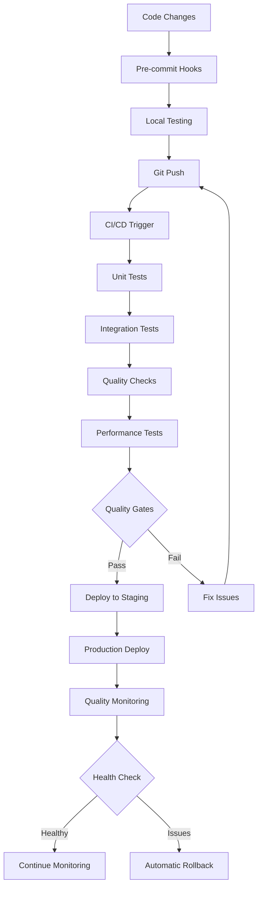

# Quality and Testing Requirements - CNPJ Receita Federal ETL

## 1. Product Overview
The CNPJ Receita Federal ETL pipeline requires comprehensive quality assurance and testing capabilities to ensure reliable processing of Brazilian corporate data. This document defines the requirements for automated testing, code quality, and continuous integration to maintain high standards of data integrity and system reliability.

The system must provide robust validation of CNPJ data, ensure database integrity, and maintain high performance while processing millions of corporate records from the Brazilian Federal Revenue Service.

## 2. Core Features

### 2.1 User Roles
| Role | Registration Method | Core Permissions |
|------|---------------------|------------------|
| Developer | GitHub repository access | Run tests, view quality reports, modify code |
| QA Engineer | Team assignment | Execute test suites, analyze coverage, review quality metrics |
| DevOps Engineer | Infrastructure access | Configure CI/CD, manage deployments, monitor system health |
| Data Engineer | Database access | Validate data quality, run integration tests, monitor ETL performance |

### 2.2 Feature Module
The quality assurance system consists of the following main components:

1. **Automated Testing Suite**: Unit tests, integration tests, and performance benchmarks
2. **Code Quality Dashboard**: Real-time monitoring of code quality metrics and trends
3. **CI/CD Pipeline**: Automated testing and deployment with quality gates
4. **Data Validation Framework**: Automated validation of CNPJ data integrity and format compliance
5. **Performance Monitoring**: Continuous monitoring of ETL pipeline performance and resource usage

### 2.3 Page Details
| Page Name | Module Name | Feature description |
|-----------|-------------|---------------------|
| Quality Dashboard | Test Results Overview | Display test execution results, coverage percentages, and quality trends with interactive charts and filtering options |
| Test Execution | Test Runner Interface | Provide interface for running specific test suites, viewing real-time progress, and accessing detailed test logs and failure reports |
| Code Coverage | Coverage Analysis | Show line-by-line coverage analysis, identify uncovered code sections, and generate coverage reports for different modules |
| Quality Metrics | Code Quality Monitoring | Track code complexity, maintainability index, technical debt, and quality trends over time with historical comparisons |
| CI/CD Pipeline | Build Status Monitor | Display real-time build status, deployment progress, and pipeline health with failure notifications and rollback capabilities |
| Data Validation | Data Quality Checks | Validate CNPJ format compliance, referential integrity, and data consistency with detailed error reporting and fix suggestions |
| Performance Monitor | Performance Analytics | Monitor ETL processing speed, memory usage, database performance, and network throughput with alerting for performance degradation |
| Error Analytics | Failure Analysis | Analyze test failures, error patterns, and system issues with root cause analysis and recommended solutions |

## 3. Core Process

### Developer Quality Workflow
Developers follow a quality-first approach where every code change must pass through multiple quality gates before integration. The process begins with local testing using pre-commit hooks that validate code style, type safety, and basic functionality. Once local tests pass, developers push changes to trigger the CI/CD pipeline, which runs comprehensive test suites including unit tests, integration tests, and performance benchmarks.

### QA Validation Process
QA engineers monitor the quality dashboard continuously, analyzing test results and identifying areas needing attention. When tests fail or quality metrics degrade, QA investigates root causes and works with developers to implement fixes. Regular quality reviews ensure testing strategies remain effective as the system evolves.

### Deployment Quality Gates
Before any deployment, the system must pass through automated quality gates including minimum 85% test coverage, zero type checking errors, successful integration tests, and performance benchmarks. Manual approval is required for production deployments, with rollback procedures ready for immediate activation if issues are detected.

## 4. User Interface Design

### 4.1 Design Style
- **Primary Colors**: Blue (#2563eb) for primary actions, Green (#16a34a) for success states, Red (#dc2626) for failures
- **Secondary Colors**: Gray (#6b7280) for neutral elements, Yellow (#d97706) for warnings
- **Button Style**: Rounded corners (8px radius), clear hover states, consistent sizing across the interface
- **Font**: Inter for body text, JetBrains Mono for code and logs, with clear hierarchy using font weights 400, 500, and 600
- **Layout Style**: Card-based layout with clear sections, responsive grid system, consistent spacing (8px base unit)
- **Icons**: Heroicons for interface elements, custom data visualization icons for quality metrics

### 4.2 Page Design Overview
| Page Name | Module Name | UI Elements |
|-----------|-------------|-------------|
| Quality Dashboard | Test Results Overview | Card-based layout with success/failure indicators, interactive charts using Chart.js, real-time status updates with WebSocket connections |
| Test Execution | Test Runner Interface | Clean terminal-style output with syntax highlighting, progress bars for test execution, expandable sections for detailed logs |
| Code Coverage | Coverage Analysis | Syntax-highlighted code viewer with coverage overlays, tree map visualization for module coverage, downloadable coverage reports |
| Quality Metrics | Code Quality Monitoring | Trend line charts for quality evolution, gauge charts for current metrics, comparison tables for historical data |
| CI/CD Pipeline | Build Status Monitor | Pipeline visualization with step-by-step progress, color-coded status indicators, estimated completion times |
| Data Validation | Data Quality Checks | Data grid with validation results, error highlighting with suggested fixes, export capabilities for validation reports |
| Performance Monitor | Performance Analytics | Real-time performance graphs, threshold-based alerting with visual indicators, performance comparison tools |
| Error Analytics | Failure Analysis | Error categorization with filtering options, stack trace visualization with code context, automated root cause suggestions |

### 4.3 Responsiveness
The interface is designed with a desktop-first approach, optimized for data analysis and monitoring tasks that benefit from larger screens. Mobile responsiveness is implemented for basic monitoring and status checking, with touch-friendly interactions for mobile devices. Key features like emergency alerts and basic status checks are fully accessible on mobile devices.

### 4.4 Data Visualization Guidelines
Quality metrics use appropriate chart types: line charts for trends over time, bar charts for comparative analysis, pie charts for proportional data, and gauge charts for threshold-based metrics. Color coding follows accessibility standards with sufficient contrast ratios and color-blind friendly palettes. Interactive elements provide detailed tooltips and drill-down capabilities for deeper analysis.

This comprehensive quality and testing system ensures the CNPJ Receita Federal ETL pipeline maintains the highest standards of reliability, performance, and data integrity while providing clear visibility into system health and quality metrics for all stakeholders.