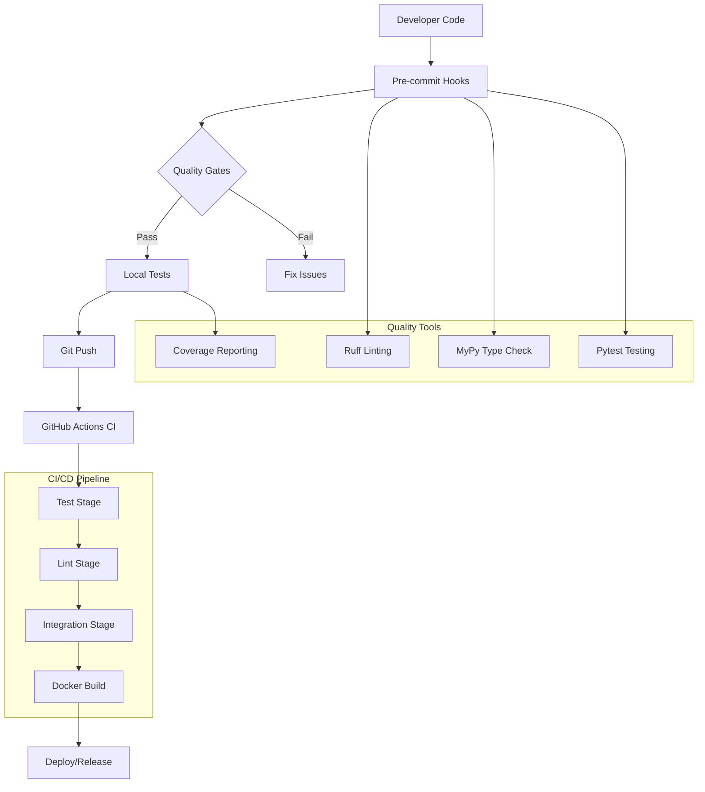
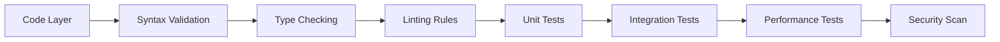

# Testing and Quality Architecture - CNPJ Receita Federal ETL

## Architecture Overview



## Technology Stack

### Testing Framework
- **Primary**: pytest 7.x with custom markers
- **Coverage**: pytest-cov with XML and terminal reporting
- **Async Testing**: pytest-asyncio for download module tests
- **Database Testing**: pytest-postgresql for integration tests

### Code Quality Tools
- **Linting**: Ruff 0.x (fast Python linter)
- **Type Checking**: MyPy 1.x with strict mode
- **Formatting**: Black 23.x with 100-character line length
- **Import Sorting**: isort for consistent import ordering

### CI/CD Infrastructure
- **Platform**: GitHub Actions
- **Python Versions**: 3.10+ (primary), with matrix testing
- **Database**: PostgreSQL 14-16 in containerized services
- **Caching**: pip dependencies and Docker layers

## Test Architecture

### Test Categories

#### 1. Unit Tests (Fast, Isolated)
```python
# Example: test_validation.py
def test_cnpj_format_validation():
    """Test CNPJ format validation logic"""
    valid_cnpj = "11.111.111/0001-11"
    invalid_cnpj = "11.111.111/0001-XX"
    
    assert validate_cnpj_format(valid_cnpj) is True
    assert validate_cnpj_format(invalid_cnpj) is False
```

#### 2. Integration Tests (Database Required)
```python
# Example: test_db_integration.py
@pytest.mark.integration
def test_database_loader_with_sample_data(postgresql):
    """Test complete data loading pipeline"""
    # Setup test database
    # Load sample CSV data
    # Verify data integrity
    # Check constraint enforcement
```

#### 3. Component Tests (External Dependencies)
```python
# Example: test_downloader.py
@pytest.mark.asyncio
async def test_download_with_retry_mechanism():
    """Test download resilience with network failures"""
    # Mock network failures
    # Verify retry attempts
    # Check final success/failure handling
```

### Test Data Management
- **Sample Data**: Minimal CSV files for testing
- **Mock Data**: Generated CNPJ records for validation
- **Database Fixtures**: PostgreSQL schemas with test data
- **File Artifacts**: Temporary directories for download tests

## Quality Assurance Architecture

### Multi-Layer Validation



### Error Handling Strategy
```python
# Standardized error hierarchy
class CNPJETLError(Exception):
    """Base exception for ETL pipeline"""
    pass

class DownloadError(CNPJETLError):
    """Download-related failures"""
    pass

class ValidationError(CNPJETLError):
    """Data validation failures"""
    pass

class DatabaseError(CNPJETLError):
    """Database operation failures"""
    pass
```

## Database Testing Architecture

### PostgreSQL Service Configuration
```yaml
# GitHub Actions service definition
services:
  postgres:
    image: postgres:16
    env:
      POSTGRES_USER: cnpj
      POSTGRES_PASSWORD: cnpj
      POSTGRES_DB: cnpj
    ports:
      - 5432:5432
    options: >-
      --health-cmd "pg_isready -U cnpj -d cnpj"
      --health-interval 10s
      --health-timeout 5s
      --health-retries 5
```

### Test Database Lifecycle
1. **Setup**: Create test database schema
2. **Migration**: Apply schema changes and constraints
3. **Data Loading**: Insert test data
4. **Validation**: Verify data integrity
5. **Cleanup**: Drop test database

## Performance Testing Framework

### Benchmark Categories
- **Download Speed**: Network throughput measurement
- **Processing Time**: CSV parsing and validation
- **Database Load**: Bulk insert performance
- **Memory Usage**: Peak memory consumption

### Performance Metrics Collection
```python
# Example performance test
@pytest.mark.performance
def test_database_load_performance(benchmark):
    """Benchmark database loading speed"""
    result = benchmark(load_large_dataset)
    assert result.rows_per_second > 10000
    assert result.memory_usage_mb < 512
```

## Monitoring and Observability

### Test Result Analytics
- **Execution Time Trends**: Track test performance over time
- **Flaky Test Detection**: Identify unstable tests
- **Coverage Evolution**: Monitor coverage improvements
- **Failure Pattern Analysis**: Identify common failure modes

### Quality Metrics Dashboard
```python
# Quality metrics collection
def collect_quality_metrics():
    return {
        'test_coverage': get_coverage_percentage(),
        'type_errors': count_mypy_errors(),
        'lint_violations': count_ruff_violations(),
        'test_execution_time': get_test_duration(),
        'flaky_test_count': detect_flaky_tests()
    }
```

## Continuous Improvement Process

### Quality Review Cycle
1. **Weekly**: Test failure analysis and fixes
2. **Monthly**: Coverage analysis and improvement planning
3. **Quarterly**: Architecture review and tool updates
4. **Annually**: Complete quality strategy review

### Tool Evolution Strategy
- **Regular Tool Updates**: Keep quality tools current
- **Performance Optimization**: Optimize test execution speed
- **New Tool Evaluation**: Assess emerging quality tools
- **Best Practice Documentation**: Maintain quality guidelines

## Deployment Quality Gates

### Pre-deployment Checks
- All tests must pass (unit + integration)
- Code coverage must exceed 85%
- Zero type checking errors
- Zero linting violations
- Performance benchmarks met
- Security scan passed

### Production Readiness Criteria
- Database migration tests passed
- Data integrity validation complete
- Rollback procedure tested
- Monitoring and alerting configured
- Documentation updated

## Troubleshooting Guide

### Common Test Failures
1. **Database Connection Issues**: Check PostgreSQL service
2. **Network Test Failures**: Verify proxy configuration
3. **Memory Issues**: Increase test environment resources
4. **Timeout Errors**: Adjust test timeout configurations

### Quality Tool Configuration
- **Ruff**: Configured in `ruff.toml`
- **MyPy**: Configuration in `mypy.ini`
- **Pytest**: Settings in `pytest.ini`
- **Coverage**: Thresholds in CI configuration

This architecture ensures consistent code quality and reliable testing throughout the development lifecycle.