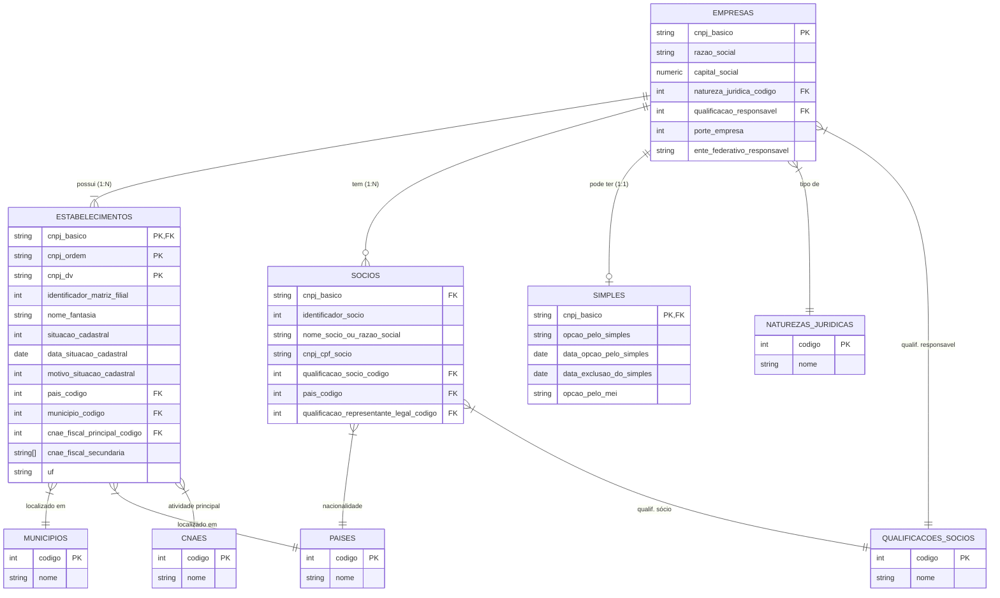

# CNPJ Dados Abertos — Pipeline de ETL para PostgreSQL

Ferramenta de ETL (Extract, Transform, Load) de alto desempenho para automatizar o download, tratamento e carga dos dados públicos de CNPJ
[disponibilizados pela Receita Federal do Brasil](https://arquivos.receitafederal.gov.br/dados/cnpj/dados_abertos_cnpj/).

Foco em **performance** e **robustez** usando `COPY FROM STDIN`, tabelas `UNLOGGED` e processamento em _chunks_ via Pandas. O pipeline é **modular**: se uma etapa falhar, corrija o problema e recomece diretamente do módulo correspondente.

> Nota de integridade: em algumas versões a Receita pode publicar dados com lacunas. Ex.: versão `2025-11` sem o código de país `150`. Se houver chaves estrangeiras ausentes (ex.: sócio sem domínio correspondente), os dados já terão sido carregados; corrija a lacuna diretamente no banco e execute `constraints.sql` para aplicar/reaplicar restrições e garantir um banco **íntegro**.

```bash
python -m src.<modulo>
```

## ⚡ TL;DR (Como rodar)

1. PostgreSQL instalado e com pelo menos ~80GB livres.
2. `poetry install` e configure o `.env` (veja exemplo abaixo).
3. Execute `python -m src.check_update` ou rode `main.py` para checar e processar novas versões automaticamente.
4. Em caso de inconsistências, corrija os dados de domínio e rode `constraints.sql`.

## 🚀 Fluxo de Dados

1. Verificação Automática
   - Compara a versão online com a última processada em `data/last_version_processed.txt`.
   - Pode ser agendado (cron) apontando para `main.py`.
   - Módulo: `check_update.py`.

2. Download
   - Multi-thread (até 4 conexões simultâneas) com controle opcional de taxa.
   - Módulo: `downloader.py`.

3. Descompactação
   - Extrai os `.zip` publicados em partes (ex.: `empresas01.zip`, `empresas02.zip`), consolidando a saída em uma pasta única.
   - Módulo: `extract_files.py`.

4. Consolidação de CSVs
   - Agrupa os CSVs descompactados em **um arquivo por categoria**, simplificando a carga.
   - Módulo: `consolidate_csv.py`.

5. Carga no Banco
   - Inserção em massa via `psycopg` com `COPY FROM STDIN`.
   - Tabelas `UNLOGGED` para acelerar a escrita inicial.
   - Limpeza de dados: conversões de data, arrays para CNAEs, decimais, etc.
   - Aplicação de PKs, FKs e índices **após** a carga.
   - Módulo: `database_loader.py`.

## ⚙️ Configuração e Instalação

### Pré-requisitos

- PostgreSQL instalado e rodando.
- **Espaço em disco:** recomenda-se **80GB livres** (compactados + extraídos + banco).

### Instalação

```bash
git clone https://github.com/FolcloreX/CNPJ-Receita-Federal
cd CNPJ-Receita-Federal
poetry install
poetry shell
```

### Configuração (.env)

Crie `.env` na raiz (ou renomeie `.env.example`). Há opções adicionais em `settings.py`.

```text
# URL RFB
RFB_BASE_URL="https://arquivos.receitafederal.gov.br/dados/cnpj/dados_abertos_cnpj/"

# Database
POSTGRES_USER=postgres
POSTGRES_PASSWORD=postgres
POSTGRES_HOST=localhost
POSTGRES_PORT=5432
POSTGRES_DATABASE=Dados_RFB

# Arquivos e processamento
FILE_ENCODING=latin1
CHUNK_SIZE=200_000

# Logging e rede
LOG_LEVEL=INFO
RATE_LIMIT_PER_SEC=0
VERIFY_ZIP_INTEGRITY=true
```

## 📈 Performance e Robustez

- `UNLOGGED` acelera a escrita inicial; restrições e índices são aplicados depois.
- `COPY FROM STDIN` minimiza overhead de INSERTs individuais.
- Processamento em _chunks_ evita estouro de memória em arquivos grandes.
- `RATE_LIMIT_PER_SEC` (>0) ativa limitação de taxa de download.
- Verificação de integridade dos ZIPs (`VERIFY_ZIP_INTEGRITY=true`).

## ✅ Testes

- Unitários: `pytest -q`.
- Integração (requer Postgres): defina `PG_INTEGRATION=1` e variáveis de banco no `.env`, então rode `pytest -q -m integration`.

## 🧭 Erros Comuns e Soluções

- Códigos de domínio ausentes (ex.: países): insira/ajuste no domínio e reexecute `constraints.sql`.
- Falha na integridade de ZIP: rebaixe o arquivo; ative `VERIFY_ZIP_INTEGRITY`.
- Encoding: ajuste `FILE_ENCODING` conforme arquivo (default `latin1`).
- Espaço insuficiente: limpe a pasta de extração/temporários antes de reprocessar.

## 📊 Diagrama do Banco (ER)

Visualize também o PDF oficial da Receita: [CNPJ Metadados](https://www.gov.br/receitafederal/dados/cnpj-metadados.pdf). Há uma versão em Markdown em `docs`.


```mermaid
erDiagram
    %% ==========================================
    %% TABELAS PRINCIPAIS
    %% ==========================================

    EMPRESAS {
        string cnpj_basico PK
        string razao_social
        numeric capital_social
        int natureza_juridica_codigo FK
        int qualificacao_responsavel FK
        int porte_empresa
        string ente_federativo_responsavel
    }

    ESTABELECIMENTOS {
        string cnpj_basico PK, FK
        string cnpj_ordem PK
        string cnpj_dv PK
        int identificador_matriz_filial
        string nome_fantasia
        int situacao_cadastral
        date data_situacao_cadastral
        int motivo_situacao_cadastral
        int pais_codigo FK
        int municipio_codigo FK
        int cnae_fiscal_principal_codigo FK
        string[] cnae_fiscal_secundaria
        string uf
    }

    SOCIOS {
        string cnpj_basico FK
        int identificador_socio
        string nome_socio_ou_razao_social
        string cnpj_cpf_socio
        int qualificacao_socio_codigo FK
        int pais_codigo FK
        int qualificacao_representante_legal_codigo FK
    }

    SIMPLES {
        string cnpj_basico PK, FK
        string opcao_pelo_simples
        date data_opcao_pelo_simples
        date data_exclusao_do_simples
        string opcao_pelo_mei
    }

    %% ==========================================
    %% TABELAS DE DOMÍNIO
    %% ==========================================

    NATUREZAS_JURIDICAS {
        int codigo PK
        string nome
    }

    QUALIFICACOES_SOCIOS {
        int codigo PK
        string nome
    }

    CNAES {
        int codigo PK
        string nome
    }

    PAISES {
        int codigo PK
        string nome
    }

    MUNICIPIOS {
        int codigo PK
        string nome
    }

    %% ==========================================
    %% RELACIONAMENTOS
    %% ==========================================

    EMPRESAS ||--|{ ESTABELECIMENTOS : "possui (1:N)"
    EMPRESAS ||--o{ SOCIOS : "tem (1:N)"
    EMPRESAS ||--o| SIMPLES : "pode ter (1:1)"

    EMPRESAS }|--|| NATUREZAS_JURIDICAS : "tipo de"
    EMPRESAS }|--|| QUALIFICACOES_SOCIOS : "qualif. responsavel"

    ESTABELECIMENTOS }|--|| MUNICIPIOS : "localizado em"
    ESTABELECIMENTOS }|--|| PAISES : "localizado em"
    ESTABELECIMENTOS }|--|| CNAES : "atividade principal"

    SOCIOS }|--|| PAISES : "nacionalidade"
    SOCIOS }|--|| QUALIFICACOES_SOCIOS : "qualif. sócio"
```

### Explicação Visual das Ligações

1. **EMPRESAS (Central)**: É a tabela pai. Ela conecta com:

   - **ESTABELECIMENTOS**: Ligação forte (PK composta). Uma empresa tem várias filiais.

   - **SOCIOS**: Uma empresa tem vários sócios.

   - **SIMPLES**: Uma empresa pode ou não ter registro no Simples (0 ou 1).

2. **ESTABELECIMENTOS**:

   - Conecta com **CNAES** (Atividade econômica).

   - Conecta com **MUNICIPIOS** e **PAISES** (Geografia).

   - Nota: cnae_fiscal_secundaria não tem linha no diagrama ligando a CNAES porque implementamos como um **Array** de texto para performance, e não como uma tabela associativa (N:N), embora logicamente sejam códigos CNAE.

3. **SOCIOS**:

   - Conecta com **QUALIFICACOES** (Para saber se é diretor, presidente, etc).

## 🤝 Contribuição

Abra issues para relatar inconsistências nos dados da Receita ou envie PRs com melhorias de performance e confiabilidade.
