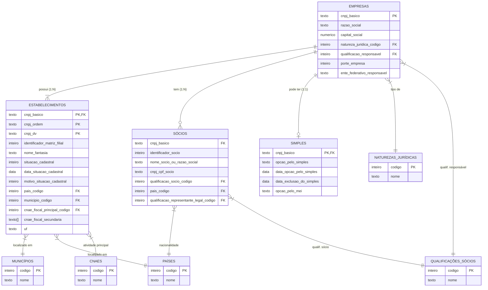

# CNPJ Dados Abertos - Pipeline de `ETL` para PostgreSQL

Ferramenta de `ETL` (Extract, Transform, Load) de alto desempenho para baixar, tratar e carregar os dados públicos de CNPJ
[(disponibilizados pela Receita Federal do Brasil)](https://arquivos.receitafederal.gov.br/dados/cnpj/dados_abertos_cnpj/).

- Foco em **performance** com `COPY FROM STDIN`, tabelas `UNLOGGED` e processamento em _chunks_ via Pandas.
- Pipeline **modular**: se alguma etapa falhar, corrija e retome diretamente daquele ponto.
- Nota de integridade: eventualmente a Receita publica versões com lacunas (ex.: `2025-11` sem o código de país `150`). Se houver FKs ausentes, corrija no banco e execute `constraints.sql` para aplicar/reaplicar as restrições.

```bash
python -m src.<modulo>
```

## Como usar (rápido)

1. Instale as dependências e configure o `.env`.
2. Execute `python -m src.check_update` para verificar novas versões.
3. Rode `main.py` para orquestrar automaticamente todo o pipeline, ou execute módulos individualmente:
   - `python -m src.downloader`
   - `python -m src.extract_files`
   - `python -m src.consolidate_csv`
   - `python -m src.database_loader`

## Exemplos por etapa

- Verificar nova versão e preparar diretórios
  - `python -m src.check_update`

- Download multithread dos ZIPs
  - `python -c "from src.downloader import run_download; run_download()"`

- Descompactação por grupos (empresas, estabelecimentos, etc.)
  - `python -m src.extract_files`

- Consolidação de CSVs (um arquivo por categoria)
  - `python -c "from src.consolidate_csv import run_consolidation; run_consolidation()"`

- Carga no PostgreSQL (COPY + limpeza por chunks)
  - `python -c "from src.database_loader import run_loader; run_loader()"`

- Aplicar constraints e índices (demorado)
  - `python -c "from src.database_loader import run_constraints; run_constraints()"`

# Fluxo de dados

## 1. Verificação automática

- Compara a versão online com a última processada em `data/last_version_processed.txt`.
- Pode ser agendada (cron ou task scheduler) apontando para `main.py`.
- Módulo: `check_update.py`.

## 2. Download

- Multi-thread (até 4 conexões simultâneas) com controle opcional de taxa.
- Módulo: `downloader.py`.

## 3. Descompactação

- Extrai os `.zip` publicados em partes (ex.: `empresas01.zip`, `empresas02.zip`), consolidando a saída em uma pasta única.
- Módulo: `extract_files.py`.

## 4. Consolidação de CSVs

- Agrupa os CSVs descompactados em **um arquivo por categoria**, simplificando a carga.
- Módulo: `consolidate_csv.py`.

## 5. Carga no banco

- Inserção em massa via `psycopg` com `COPY FROM STDIN`.
- Tabelas `UNLOGGED` para acelerar a escrita inicial.
- Limpeza de dados: conversões de data, arrays para CNAEs, decimais, etc.
- Aplicação de PKs, FKs e índices **após** a carga.
- Módulo: `database_loader.py`.

## Configuração e instalação

### Pré-requisitos

- PostgreSQL instalado e em execução.
- Espaço em disco recomendado: **80 GB livres** (compactados + extraídos + banco).

### Instalação

```bash
# Clone o repositório
git clone https://github.com/FolcloreX/CNPJ-Receita-Federal
cd CNPJ-Receita-Federal

# Instale as dependências com Poetry
poetry install
poetry shell
```

### Configuração (.env)

Crie um arquivo `.env` na raiz do projeto, existe um exemplo `.env.example` que você também pode renomear. Em `settings.py` há mais configurações opcionais.

```text
# URL RFB
RFB_BASE_URL="https://arquivos.receitafederal.gov.br/dados/cnpj/dados_abertos_cnpj/"

# Database configuration
POSTGRES_USER=postgres
POSTGRES_PASSWORD=postgres
POSTGRES_HOST=localhost
POSTGRES_PORT=5432
POSTGRES_DATABASE=Dados_RFB

# File configuration
FILE_ENCODING=latin1
CHUNK_SIZE=200_000

# Logging configuration
LOG_LEVEL=INFO
```

### Variáveis do `.env`

| Variável                 | Descrição                                                     | Padrão |
|--------------------------|---------------------------------------------------------------|--------|
| `RFB_BASE_URL`           | URL base da Receita para os dados abertos do CNPJ            | ver acima |
| `POSTGRES_USER`          | Usuário do PostgreSQL                                        | —      |
| `POSTGRES_PASSWORD`      | Senha do PostgreSQL                                          | —      |
| `POSTGRES_HOST`          | Host do banco (ex.: `localhost`, `db`)                       | —      |
| `POSTGRES_PORT`          | Porta do banco                                               | `5432` |
| `POSTGRES_DATABASE`      | Nome do banco de dados                                       | —      |
| `FILE_ENCODING`          | Encoding dos CSVs da Receita                                 | `latin1` |
| `CHUNK_SIZE`             | Linhas por chunk no Pandas                                   | `200000` |
| `LOG_LEVEL`              | Nível de log (`DEBUG`, `INFO`, `WARNING`, `ERROR`)           | `INFO` |
| `MAX_WORKERS`            | Downloads simultâneos                                        | `4` |
| `EXTRACT_WORKERS`        | Paralelismo na extração de ZIPs                              | `2` |
| `DOWNLOAD_CHUNK_SIZE`    | Tamanho do buffer de download em bytes                       | `8192` |
| `USE_UNLOGGED`           | Cria tabelas como `UNLOGGED` na carga inicial                | `true` |
| `SET_LOGGED_AFTER_COPY`  | Retorna tabelas a `LOGGED` após a carga                      | `true` |
| `CLUSTER_AFTER_COPY`     | Aplica `CLUSTER` ao final (muito lento)                      | `false` |
| `SKIP_CONSTRAINTS`       | Pular criação de PKs, FKs e índices                          | `false` |
| `NORMALIZE_LINE_ENDINGS` | Normaliza quebras de linha                                   | `true` |
| `STRIP_BOM`              | Remove BOM do início dos arquivos                            | `true` |

## Performance e robustez

- Tabelas `UNLOGGED` aceleram a escrita inicial; restrições e índices são aplicados depois.
- `COPY FROM STDIN` minimiza overhead de operações de inserção individuais.
- Processamento em _chunks_ evita estouro de memória com arquivos grandes.
- `VERIFY_ZIP_INTEGRITY=true` habilita verificação de integridade de ZIPs.
- `RATE_LIMIT_PER_SEC` (>0) ativa limitação de taxa de download.

## Testes

- Unitários: execute `pytest -q`.
- Integração (requer Postgres): defina `PG_INTEGRATION=1` e variáveis de banco no `.env`, depois rode `pytest -q -m integration`.

## Diagrama do banco (ER)

Também pode ser visualizado em um PDF direto no [Site da receita](https://www.gov.br/receitafederal/dados/cnpj-metadados.pdf)
Há uma versão em markdown em `docs`.



### Explicação visual das ligações

1. **EMPRESAS (Central)**: É a tabela pai. Ela conecta com:

   - **ESTABELECIMENTOS**: Ligação forte (PK composta). Uma empresa pode ter várias filiais.

   - **SÓCIOS**: Uma empresa tem vários sócios.

   - **SIMPLES**: Uma empresa pode ou não ter registro no Simples (0 ou 1).

2. **ESTABELECIMENTOS**:

   - Conecta com **CNAES** (atividade econômica).

   - Conecta com **MUNICÍPIOS** e **PAÍSES** (geografia).

   - Nota: `cnae_fiscal_secundaria` é um **array** de texto para performance (em vez de tabela associativa N:N), embora represente códigos CNAE.

3. **SOCIOS**:

   - Conecta com **QUALIFICAÇÕES** (diretor, presidente, etc.).

## Contribuição

- Abra issues para relatar inconsistências nos dados ou propor melhorias.
- Envie PRs com otimizações de performance, confiabilidade e manutenção.
