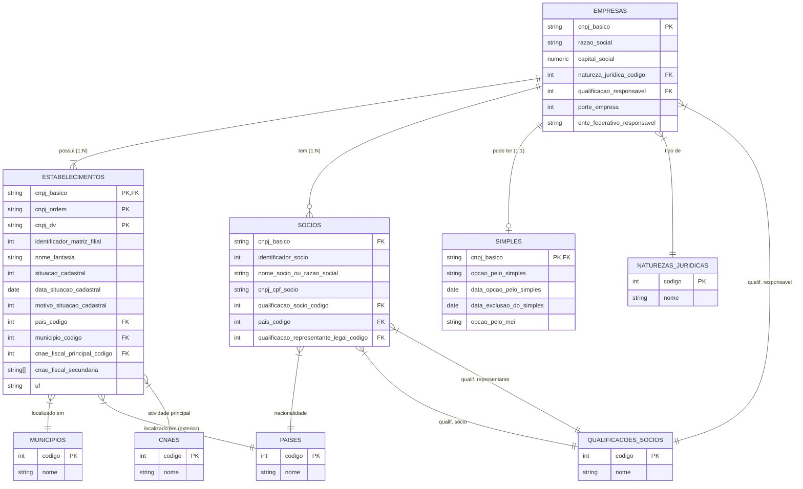

[[Voltar ao README]](../README.md) • [[Descrição dos dados]](descricao-dados.md)

```mermaid
erDiagram
    %% ==========================================
    %% TABELAS PRINCIPAIS
    %% ==========================================

    EMPRESAS {
        string cnpj_basico PK
        string razao_social
        numeric capital_social
        int natureza_juridica_codigo FK
        int qualificacao_responsavel FK
        int porte_empresa
        string ente_federativo_responsavel
    }

    ESTABELECIMENTOS {
        string cnpj_basico PK, FK
        string cnpj_ordem PK
        string cnpj_dv PK
        int identificador_matriz_filial
        string nome_fantasia
        int situacao_cadastral
        date data_situacao_cadastral
        int motivo_situacao_cadastral
        int pais_codigo FK
        int municipio_codigo FK
        int cnae_fiscal_principal_codigo FK
        string[] cnae_fiscal_secundaria
        string uf
    }

    SOCIOS {
        string cnpj_basico FK
        int identificador_socio
        string nome_socio_ou_razao_social
        string cnpj_cpf_socio
        int qualificacao_socio_codigo FK
        int pais_codigo FK
        int qualificacao_representante_legal_codigo FK
    }

    SIMPLES {
        string cnpj_basico PK, FK
        string opcao_pelo_simples
        date data_opcao_pelo_simples
        date data_exclusao_do_simples
        string opcao_pelo_mei
    }

    %% ==========================================
    %% TABELAS DE DOMÍNIO (SATÉLITES)
    %% ==========================================

    NATUREZAS_JURIDICAS {
        int codigo PK
        string nome
    }

    QUALIFICACOES_SOCIOS {
        int codigo PK
        string nome
    }

    CNAES {
        int codigo PK
        string nome
    }

    PAISES {
        int codigo PK
        string nome
    }

    MUNICIPIOS {
        int codigo PK
        string nome
    }

    %% ==========================================
    %% RELACIONAMENTOS
    %% ==========================================

    %% Relacionamentos das Empresas
    EMPRESAS ||--|{ ESTABELECIMENTOS : "possui (1:N)"
    EMPRESAS ||--o{ SOCIOS : "tem (1:N)"
    EMPRESAS ||--o| SIMPLES : "pode ter (1:1)"
    
    EMPRESAS }|--|| NATUREZAS_JURIDICAS : "tipo de"
    EMPRESAS }|--|| QUALIFICACOES_SOCIOS : "qualif. responsavel"

    %% Relacionamentos dos Estabelecimentos
    ESTABELECIMENTOS }|--|| MUNICIPIOS : "localizado em"
    ESTABELECIMENTOS }|--|| PAISES : "localizado em (exterior)"
    ESTABELECIMENTOS }|--|| CNAES : "atividade principal"

    %% Relacionamentos dos Sócios
    SOCIOS }|--|| PAISES : "nacionalidade"
    SOCIOS }|--|| QUALIFICACOES_SOCIOS : "qualif. sócio"
    SOCIOS }|--|| QUALIFICACOES_SOCIOS : "qualif. representante"
```
