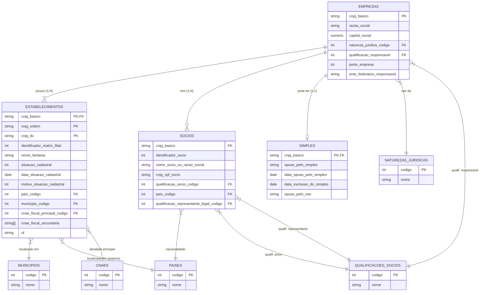

[[Voltar ao README]](../README.md) • [[Descrição dos dados]](descricao-dados.md)

## Explicação visual das ligações

1. **EMPRESAS (Central)**: Tabela pai.
   - **ESTABELECIMENTOS**: ligação forte (PK composta). Uma empresa pode ter várias filiais.
   - **SÓCIOS**: uma empresa tem vários sócios.
   - **SIMPLES**: uma empresa pode ou não ter registro no Simples (0 ou 1).

2. **ESTABELECIMENTOS**:
   - Conecta com **CNAES** (atividade econômica).
   - Conecta com **MUNICÍPIOS** e **PAÍSES** (geografia).
   - Nota: `cnae_fiscal_secundaria` é um **array** de texto para performance (em vez de tabela associativa N:N), embora represente códigos CNAE. 

3. **SÓCIOS**:
   - Conecta com **QUALIFICAÇÕES** (diretor, presidente, etc.).

